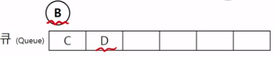
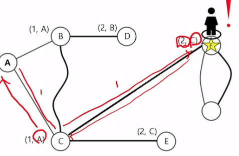
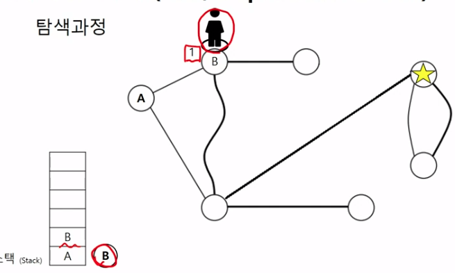
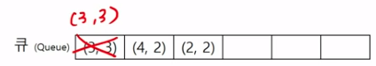

# CodingTest Prepare

--- 
 - Lecture: IT 기업 취업을 위한: 코딩 테스트 혼자서 정복하기 (INFLEARN, 26,400원)
 - Date: '22.3/9~
 - Writer: Sungwook LE
 - Language: `C++`
 - 목표:
    1. 문제가 요구하는 알고리즘을 파악할 수 있다.
    2. 최소한의 문법으로 최대한 깔끔한 코드를 작성할 수 있다. 
    3. 공통적으로 출제되는 문제의 **템플릿**을 작성/이해하고 이를 통해 문제를 풀자.
--- 

{:toc}

## 1. Dynamic Programming 동적프로그래밍
- Dynamic Programming = **분할정복 프로그래밍**
- 분할정복 풀이: `Bottom-up` 방식으로 점화식(`recurrence relation`)을 유도하여 풀자
    - 문제를 직접 풀려고 `if`문을 생각하게 되면, 여러 예외조건에 막혀 문제를 풀 수 없게된다는 것을 명심
    - 분할정복 문제는 배열을 이용해서 풀게되는데, 이 때!, `0` 번째 케이스에 대한 값을 0과 같은 default 값을 넣어줌으로써 `trivial case` 에 대한 값을 명시적으로 배열을 채워서 풀자.
    - Top-down 방식으로 풀어야하는 문제도 있으나, 대부분 Bottom-up 방식이 풀기 쉽다.
### 1-1. 분할정복 풀이를 위한 점화식
1. 수열의 n번째 값 $a_n$을 구하기 위해 따라야 하는 규칙
2. $a_n$을 구하기 위해서는, $a_1$부터 순서대로 계산해야 함

### 1-2. 점화식은 Bottom-Up으로 풀자 
- 점화식이 아래와 같을 때, $a_5$를 구하여라.
    - $a_1 = 3$ 
    - $a_n = 2a_{n-1}-4$

- Solution: Bottom-up 접근

    

### 1-3. 배열을 이용한 점화식 풀이 방법

- [dp_sequence.cpp](./DynamicProgramming/dp_sequence.cpp)
- 실제 코딩테스트 문제는 `점화식`을 주지 않으니, 직접 유도해야 한다.

### 1-4. 연습문제(1차원 DP)
- 큰 문제를 작은 문제부터 해결하여 계산하기: 1차원 배열
#### 1. 특정 금액을 만들 수 있는 동전의 최소개수를 찾아라

    - 풀이: 20원으로 조합되기 위한 조합의 수는 15원의 조합 + 1 또는 17원의 조합 + 1 의 조합의 수를 갖는다.
    
    - 점화식:
    
    - 배열 설계:
    
    
    - 코드: [dp_changecoin.cpp](./DynamicProgramming/dp_changecoin.cpp)
        
### 1-5. 실전문제(2차원 DP)
- 큰 문제를 작은 문제부터 해결하여 계산하기: 2차원 배열
#### 1. 가방에 담을 수 있는 보석의 최대 값어치를 담아 훔쳐라

- 풀이: 작은 문제들을 풀어나가는 과정을 통해 N=4, K=14 위치의 값어치를 찾아보는 것을 생각해보자.
    
    
    
    
- 점화식: 
    ```c++
    if (j >= W)
        DP[i][j] = max(DP[i-1][j], DP[i-1][j-W]+current_price)
     // 배낭의 무게 허용량(j)이 보석의 무게(W)보다 크다면, 새로운 보석을 넣었을 때와 넣지 않았을 때의 max값이 가방에 들어갈 수 있는 보석의 최대값어치이다. 
    else if (j < W)
        DP[i][j] = DP[i-1][j]
    // 보석의 무게(W)가 배낭 허용량(j)보다 무거운 케이스
    ```
- 코드: [dp_backpack_ruby.cpp](./DynamicProgramming/dp_backpack_ruby.cpp)

#### 2. 주어진 두개의 문자열의 LCS(Longest Common Sequence)를 찾아라

 - 풀이: 작은 문제들을 풀어나가는 과정을 통해 `LCS`를 찾아내자.
 - 문제의 조건에서 `LCS`는 연속적일 문자열일 필요는 없었다.
 - 점화식:
    
    

    ```c++
    vector<vector<int>> DP(A.length()+1, vector<int>(B.length()+1,0));
    string A_token_last;
    for(int i = 1 ; i <= A.length(); ++i){
        A_token_last = A[i-1];
        string B_token_last;
        for(int j = 1 ; j <= B.length(); ++j){
            B_token_last = B[j-1];
            if (A_token_last == B_token_last)
                DP[i][j] = DP[i-1][j-1]+1; 
    //두 문자열의 마지막 문자가 같다면, LCS("A문자열에서 마지막 문자 제거", "B문자열에서 마지막 문자 제거") + 1 의 값의 DP[i][j]의 LCS 최대값
            else
                DP[i][j] = max(DP[i-1][j], DP[i][j-1]);
    //두 문자열의 마지막 문자가 다르다면, max(LCS("A문자열", "B문자열에서 마지막 문자 제거"), LCS("A문자열에서 마지막 문자 제거", "B문자열"))
        }
    }
    ```
 - 코드: [dp_LCS.cpp](./DynamicProgramming/dp_LCS.cpp)

#### 3. 프로그래머스 문제: 최소 N을 사용하여 주어진 number를 만드는 개수를 찾아라
 - 문제: [N으로표현](https://programmers.co.kr/learn/courses/30/lessons/42895)
 - 문제 설명
 > 아래와 같이 5와 사칙연산만으로 12를 표현할 수 있습니다.
 > * 12 = 5 + 5 + (5 / 5) + (5 / 5)
 12 = 55 / 5 + 5 / 5
 12 = (55 + 5) / 5
 > * 5를 사용한 횟수는 각각 6,5,4 입니다. 그리고 이중 가장 작은 경우는 4입니다.
 이처럼 숫자 N과 number가 주어질 때, N과 사칙연산만 사용해서 표현 할 수 있는 방법 중 N 사용횟수의 최솟값을 return 하도록 solution 함수를 작성하세요.
 > * 제한사항
 N은 1 이상 9 이하입니다.
 number는 1 이상 32,000 이하입니다. 
 수식에는 괄호와 사칙연산만 가능하며 나누기 연산에서 나머지는 무시합니다.
 최솟값이 8보다 크면 -1을 return 합니다.

- 문제 풀이: bottom-up으로 풀 수 있는 배열을 설계하여 풀자(`점화식`)
    

- 코드: [dp_programmers_N](./DynamicProgramming/dp_programmers_N.cpp)

#### 4. 프로그래머스 문제: 삼각형의 최대 합을 찾아라
 - 문제: [정수삼각형](https://programmers.co.kr/learn/courses/30/lessons/43105)
 - 문제 설명
 
 > * 위와 같은 삼각형의 꼭대기에서 바닥까지 이어지는 경로 중, 거쳐간 숫자의 합이 가장 큰 경우를 찾아보려고 합니다. 아래 칸으로 이동할 때는 대각선 방향으로 한 칸 오른쪽 또는 왼쪽으로만 이동 가능합니다. 예를 들어 3에서는 그 아래칸의 8 또는 1로만 이동이 가능합니다.
 > 삼각형의 정보가 담긴 배열 triangle이 매개변수로 주어질 때, 거쳐간 숫자의 최댓값을 return 하도록 solution 함수를 완성하세요.
 > * 제한사항
 삼각형의 높이는 1 이상 500 이하입니다.
 삼각형을 이루고 있는 숫자는 0 이상 9,999 이하의 정수입니다

 - 문제 풀이: bottom-up으로 풀 수 있는 배열을 설계하여 풀자(`점화식`)
 - 처음 생각한 방식은 삼각형의 위에서 부터 모든 경로에 대한 경우의 수를 따지는 것은 동적프로그래밍이라기 보다는 브루트포스 방식(모든 경우를 naive하게 전부 계산)가 된다.
 - 삼각형의 밑변에서 부터 시작하여 최대 합이 나오는 것을 선택해주면 모든 경우의 수를 따지지 않고서 삼각형 경로의 최대합을 구할 수 있다. 
    ```
    DP[i][j] = max( DP[i-1][j] + triangle[height-i][j-1],DP[i-1][j+1] + triangle[height-i][j-1]);
    ```
    

 - 코드: [dp_programmers_tri](./DynamicProgramming/dp_programmers_tri.cpp)


## 2. 그래프 탐색 알고리즘
 - 그래프는 노드(상태)와 엣지로 이루어져 있음
 - 그래프 탐색 알고리즘: BFS(너비우선탐색), DFS(깊이우선탐색) 알고리즘으로 나뉜다.
    1. BFS(Breadth First Search)
        - 탐색 후 방문
        - 큐(`queue`)의 역할: 탐색 노드 (방문 예정 노드) 저장
        - 큐: Last In Last Out
    2. DFS(Depth First Search)
        - 즉시 방문
        - 스택(`stack`)의 역할: 지금까지 방문한 노드 모두 저장 (Trace)
        - 스택: Last In First Out

### 2-1. 개념 이해
 1. 다리로 이어져 있는 섬을 찾아가자
    -  지웅이는 A위치에서 목적지인 F까지 이동하여야 한다.

    <details>
    <summary>BFS: 가까이 있는 섬부터 탐색하기 (너비 우선 탐색) </summary>
    
    - `큐(queue)`를 활용한 BFS 문제풀이
    - 참고: `큐(queue)`에 있는 노드는 아직 방문하지 않은 노드이고(`candidates`), 큐에서 꺼낼 때 방문
    1. default 상태 (어느 섬에도 있지 않음)
            - 
    2. A섬에 탐색을 시작
            - 
            - 
            - 
            - 
            - 
    3. B섬에 방문하여 탐색을 시작
            - 
            - 
            - 
            - 
    4. C섬에 방문하여 탐색을 시작
            - 
            - 
            - 
    5. D섬에 방문하여 탐색을 시작
            - 
    6. F섬에 방문하여 탐색을 시작
            - 
            - 목적지 F에 도착하였다. 경로의 길이는 2이다.
            - 
    </details>

    <details>
    <summary>DFS: 최대한 깊숙한 곳까지 탐색하기 (깊이 우선 탐색) </summary>

    1. A 섬에 방문한 상태 (stack에 담겨져 있음)
            - 
    2. B 섬에 방문
            - 
    3. D 섬에 방문
            - 
            - 더 이상 뻗어 나갈 곳이 없다.
            - D를 스택에서 `pop`
    4. B 섬에 돌아와서 C 섬에 방문
            - 
            - 
            - 여기서, BFS와 차이점이 지웅이는 경로 2번을 거쳐야지만 C섬으로 올 수 있다. (BFS는 1번만 거치면 C섬으로 올 수 있다고 알려주었다.)
    5. F 섬에 방문
            - 
            - 방문순서는 스택에 담겨져 있는 순서의 역순으로 기록(trace)되어 있다.
            - 
            - `F, C, B, A` 가 방문 순서가 된다.
            - DFS 알고리즘은 경로를 찾았으나, 최단 경로를 알려주는 것은 아니다.
            - 그러나 경우에 따라서, BFS로 풀어야하는 문제도 등장하기 때문에 DFS도 알아 두어야 한다.

    </details>

 2. 2차원 격자 속 미로 탈출하기
    -  민영이는 S에서 E로 가고 싶다.
    - 

    <details>
    <summary> BFS를 활용한 경로탐색(미로찾기)</summary>
    
    - `queue` 원소 제거(pop): 좌표 방문
    - `queue` 원소 삽입(push): 좌표 탐색
    1. (1,1)(시작지점)에서 시작
        - 
        - 
    2. (1,2) 방문
        - 갈 수 있는 곳 없음
    3. (2,1) 방문
        - 탐색
        - 
        - 
        - 오른쪽으로 (3,1)로만 이동 가능
    4. (3,1) 방문
        - 
        - (3,2)로만 이동 가능
        - 
    5. (3,2) 방문
        - 
        - 
        - 
    6. (3,3) 방문
        - 
        - 
        - 목표로 하는 도착 지점(4,3)이 큐에 들어옴
        - 
    7. 큐에 있는 나머지 노드에도 방문하여 탐색하고 큐에 push
    8. 도착지점인 (4,3) 방문 차례가 오면 도착지점에 도착하였으니, BFS 종료
        - (1,1)부터 (4,3) 까지 5번의 최단 경로를 찾아냄
        - 실제 방문하여 탐색하는 순서
        - 
        
    </details>

    <details>
    <summary>DFS를 활용한 경로탐색(미로찾기)</summary>

    - 스택 원소 제거(`pop`): 이전 위치로 복귀
    - 스택 원소 삽입(`push`): 새로운 좌표 방문
    1. (1,1) 시작지점에서 시작
        - 
    2. (1,2)에 방문
        - 
        - 갈 곳이 없으니까, 이전 위치로 `pop`
    3. (2,1)에 방문
        - 
    4. (3,1)에 방문
        - 
        - 
    5. (3,2)에 방문
        - 
        - 
        - 3군데로 이동 가능한데, 위부터 방문한다고 치면 (3,3)으로 이동
    6. (3,3)에 이동
        - 
        - 
        - 갈 수 있는 경로는 오른쪽 (4,3)
    7. (4,3)에 이동
        - 
        - 
        - 목적지 도착하였고 이동한 경로는 스택에 담겨져 있는 역순으로 5번의 이동이 발생 (`DFS`와 값 동일한 케이스)

    </details>

---
## END & Reference
1. [c언어 문법위키](https://wikidocs.net/book/1411)
